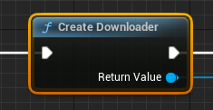
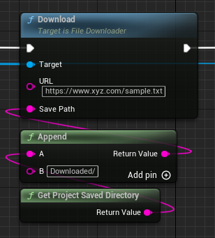
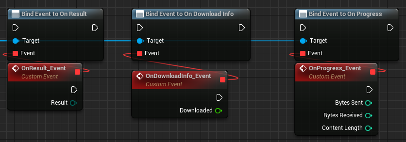

Multi Threaded Downloader is a plugin for downloading files using multithreading at runtime.

## How to use
you need  to create downloader using this node.

It gives us the return value for the downloader, using this we will call the download file function.

It also gives us the required delegates.

