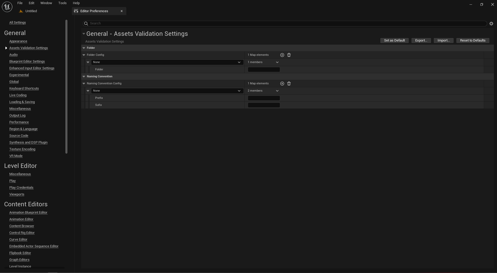

This plugin **Assets Validation** will be helpful for validating the assets and keep every thing in check and put in proper place.

## How to use

Just download the plugin and go to **Editor Preferences** and find the **Assets Validation Settings** and add your own settings.

