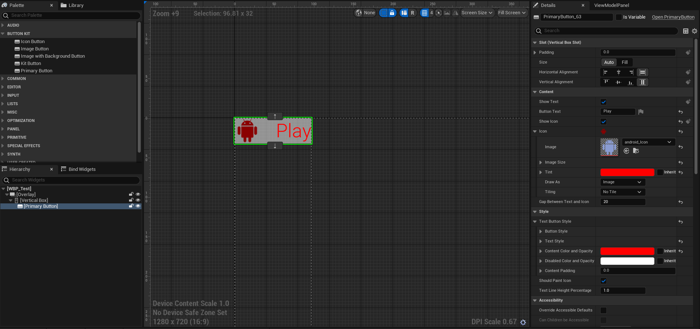

This plugin **Button Kit** will be helpful for reducing the UMG overhead and also help to reduce layering that will be way much optamized to for the project.

## How to use

Just download the plugin and go create **User Widget** and find the **Button Kit** Category in **Palette** and add your Buttons there and make awesome and fast UIs.

<iframe width="560" height="315" src="https://www.youtube.com/embed/-KO-Nv_SIQo?si=mQUNyCzZI53jrks6" title="Button Kit" frameborder="0" allow="accelerometer; autoplay; clipboard-write; encrypted-media; gyroscope; picture-in-picture; web-share" allowfullscreen></iframe>

